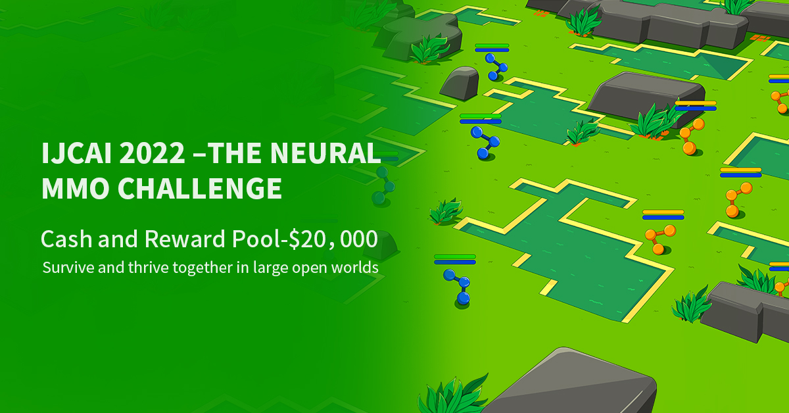
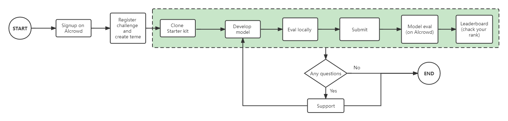

[IMPORTANT - Accept the rules before you submit](wip)

# Table of contents
- [Competition procedure](#competition-procedure)
- [Installation](#installation)
- [Baselines](#baselines)
- [Preparing your submission](#preparing-your-submission)
  * [Create submission](#1-create-submission)
  * [validate locally before submit](#2-validate-locally-before-submit)
- [Submission](#submission)
  * [Repository Structure](#repository-structure)
  * [Runtime configuration](#runtime-configuration)
  * [Submitting to AIcrowd](#submitting-to-aicrowd)
    + [`aicrowd.json`](#aicrowdjson)
    + [Configuring the submission repository](#configuring-the-submission-repository)
    + [Pushing the code to AIcrowd](#pushing-the-code-to-aicrowd)
- [Submission checklist](#submission-checklist)
- [Important links](#important-links)
- [Contributors](#contributors)


# Competition procedure

The Neural MMO Challenge is an opportunity for researchers and machine learning enthusiasts to test their skills by designing and building agents that can survive and thrive in a massively multiagent environment full of potential adversaries.

In this challenge, you will train your models locally and then upload them to AIcrowd (via git) to be evaluated.

**The following is a high level description of how this process works.**



1. **Sign up** to join the competition [on the AIcrowd website](https://www.aicrowd.com/challenges/ijcai-2022-the-neural-mmo-challenge).
2. **Clone** this repo and start developing your solution.
3. **Design and build** your agents that can compete in Neural MMO environment and create your submission as described in [create submission](#2-create-submission) section.
4. [**Submit**](#-submission) your agents to [AIcrowd Gitlab](https://gitlab.aicrowd.com) for evaluation. [Refer this for detailed instructions](#submission).


# Installation

> We recommend using `python 3.9`. If you are using Miniconda/Anaconda, you can install it using `conda install python=3.9`.


Clone the starter kit repository and install the dependencies.

```bash
pip install git+https://github.com/IJCAI2022-NMMO/ijcai2022nmmo.git
pip install -r requirements.txt
```

# Baselines

We provide a variety of baseline agents, please refer to [ijcai2022-nmmo-baselines](https://gitlab.aicrowd.com/neural-mmo/ijcai2022-nmmo-baselines) repository.

# Preparing your submission
### 1. create submission

The submission entrypoint is a python script `my-submission/submission.py`, that runs in an environment defined by `Dockerfile`.

You need to copy all your necessary code to `my-submission/` directory, and replace `submission.py` with you own implementation, which must inherit the [`Team`]() class and have [`act`]() method implemented. An example is provided in `my-submission/submission.py` for your reference.

**Note:** If your agent doesn't inherit the `Team` class, the evaluation will fail. For more information about `Team`, please refer to [ijcai2022nmmo Team](https://github.com/IJCAI2022-NMMO/ijcai2022nmmo#team).

### 2. validate locally before submit

We have provided `tool.py` to validate your submission locally. This file will execute your submission in the same way as the actual evaluation.

To run the validation locally, run the following command.

```bash
python tool.py test --remote=docker
```

If docker is not installed in your machine, you can alternatively execute local validation by running you submission as a background process. 

```bash
python tool.py test --remote=process
```
We recommend you use `--remote=docker` for local validation, which is the mode used in competition server.

Before submit, make sure you see "TEST PASS" as below.
```
______   ______     ______     ______      ______   ______     ______     ______    
/\__  _\ /\  ___\   /\  ___\   /\__  _\    /\  == \ /\  __ \   /\  ___\   /\  ___\   
\/_/\ \/ \ \  __\   \ \___  \  \/_/\ \/    \ \  _-/ \ \  __ \  \ \___  \  \ \___  \  
   \ \_\  \ \_____\  \/\_____\    \ \_\     \ \_\    \ \_\ \_\  \/\_____\  \/\_____\ 
    \/_/   \/_____/   \/_____/     \/_/      \/_/     \/_/\/_/   \/_____/   \/_____/
```

# Submission

## Repository Structure

**File/Directory** | **Description**
--- | ---
[`my-submission/`](my-submission/) | Directory containing your submission.
[`submission-runtime/`](submission-runtime/) | Directory containing the default Dockerfile and requirements.txt. Don't change it.
[`submit.sh`](submit.sh) | Helper script to submit your repository to [AIcrowd GitLab](https://gitlab.aicrowd.com).
[`Dockerfile`](Dockerfile) | Docker config for your submission. 
[`requirements.txt`](requirements.txt) | File containing the list of python packages you want to install for the submission to run.
[`tool.py`](tool.py) | Hepler script to validate your submission locally. Refer [validate locally before submit](#2-validate-locally-before-submit) for more information.

## Runtime configuration
The default runtime is provided in `submission-runtime/`. We also accept submissions with custom runtimes, so you can choose your favorite. The configuration files include `requirements.txt` file and `Dockerfile`.


## Submitting to AIcrowd

### **Add your SSH key** to AIcrowd GitLab

You can add your SSH Keys to your GitLab account by going to your profile settings [here](https://gitlab.aicrowd.com/profile/keys). If you do not have SSH Keys, you will first need to [generate one](https://docs.gitlab.com/ee/ssh/README.html#generating-a-new-ssh-key-pair).


### `aicrowd.json`

Your repository should have an `aicrowd.json` file with following fields:

```json
{
    "challenge_id" : "ijcai-2022-the-neural-mmo-challenge",
    "authors" : ["Your Name"],
    "description" : "Brief description for your submission"
}
```

This file is used to identify your submission as a part of the Neural MMO Challenge. You must use the `challenge_id` as specified above.

### Configuring the submission repository

```bash
git remote add aicrowd git@gitlab.aicrowd.com:<username>/ijcai2022-nmmo-starter-kit.git
```

**Note:** This needs to be done only once. This configuration will be saved in your repository for future use.

### Pushing the code to AIcrowd

```bash
./submit.sh "some description"
```
Then you can check your submission's status through [AIcrowd Submission](wip), if success, you would see your rank in [Leaderboard](wip) soon.

# Submission checklist

- [x] **Accept the challenge rules**. You can do this by going to the [challenge overview page](https://www.aicrowd.com/challenges/ijcai-2022-the-neural-mmo-challenge) and clicking the "Participate" button. You only need to do this once.
- [x] **Create your own submission**. The `submit.sh` will automatically detect large files and add them to git LFS. If you are using the script, please refer to [this post explaining how to add your models](https://discourse.aicrowd.com/t/how-to-upload-large-files-size-to-your-submission/2304).
- [x] **Validate your submission locally** to know that they work as expected. 
- [x] **Update runtime configuration** using `requirements.txt`, and/or `Dockerfile` as necessary. Please make sure that you specified the same package versions that you use locally on your machine.

# FAQ

#### 1. How can I render/save replay locally?

Please refer to [Neural MMO tutorial - Replay](https://colab.research.google.com/drive/1NUXIDmV5pOHFmAMGztizvuOkjr8W5Bat) for an instruction about how to rendering locally.

#### 2. Are there any hardware or time constraints?

During evaluation, your submission will be allocated with **1 CPU core and 1G memory**. Each step, your agent must give decision within **600ms**.

#### 3. Are there any file size limit for submission?

Your submission should not be larger than 13Gi.

# Important links

- Challenge information
   * [Challenge page](https://www.aicrowd.com/challenges/ijcai-2022-the-neural-mmo-challenge)
   * [Leaderboard](https://www.aicrowd.com/challenges/ijcai-2022-the-neural-mmo-challenge/leaderboards)
 - Community
    * [Neural MMO discord server](https://discord.gg/neX6e4Kc)
    * [Challenge discussion forum](https://www.aicrowd.com/challenges/ijcai-2022-the-neural-mmo-challenge/discussion)
- Neural MMO resources
    * [Neural MMO documentation](https://neuralmmo.github.io/build/html/rst/landing.html)
    * [Neural MMO GitHub repository](https://github.com/NeuralMMO/environment/tree/ijcai-competition)
    * [Neural MMO tutorial](https://colab.research.google.com/drive/1NUXIDmV5pOHFmAMGztizvuOkjr8W5Bat)
    

# Contributors
- Parametrix.ai
- Joseph Suarez
- AIcrowd


